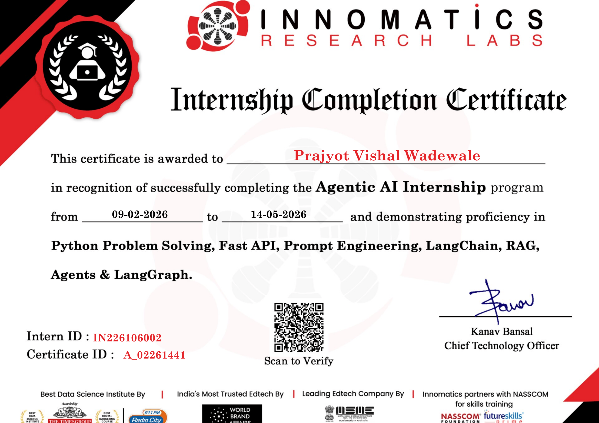

# Innomatics Research Labs Assignments

## 📌 Overview
This repository contains all assignments completed during my internship at Innomatics.

## 📂 Structure
- FastAPI
- GenAI
- NLP
- Python

## 🚀 Tech Stack
- Python
- FastAPI
- Machine Learning
- Generative AI

## 👨‍💻 Author
Prajyot Wadewale

## 📜 Internship Certificate

Successfully completed the Data Science Internship at Innomatics Research Labs.

